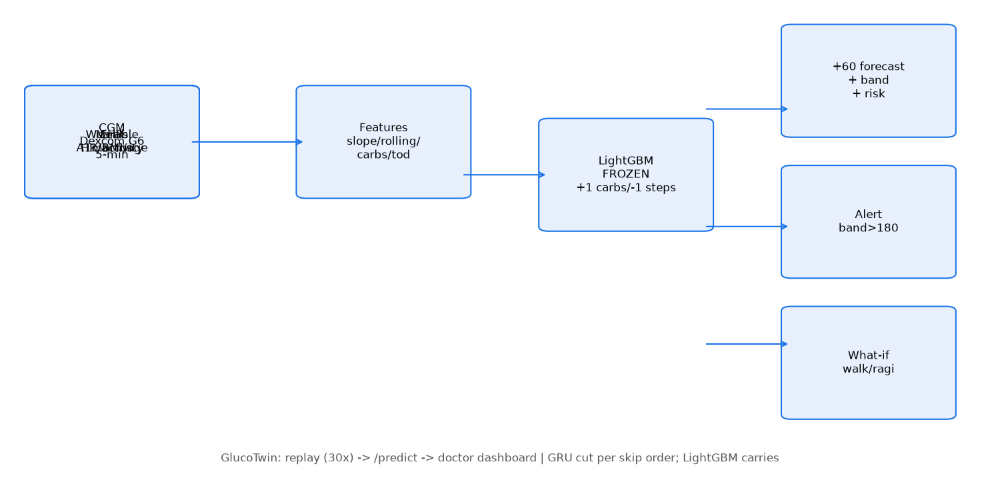
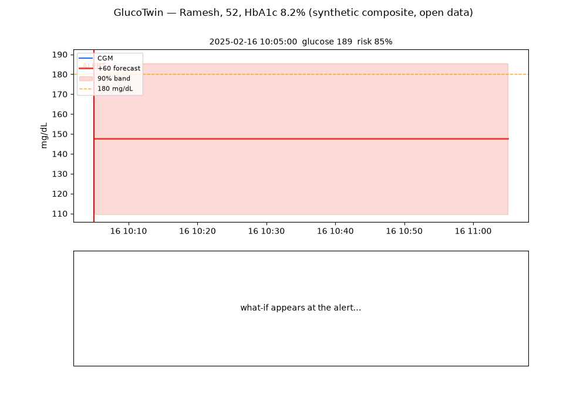

# GlucoTwin — T2D Digital Twin (PoC)

> We don't predict diabetes. We predict what is about to happen to this patient.

Doctor-facing twin that warns ~60 min in advance when glucose will exceed
180 mg/dL after a meal — and simulates what would prevent it. Built for the
Happiest Health Digital Twin Challenge 2026. `AGENTS.md` is the single source
of truth.





## One-command run (offline, frozen model)

```
docker compose up
```
Dashboard → http://localhost:8501, replay API → http://localhost:8000.
Processed data ships in the image (no download needed); the entrypoint
rebuilds from open CGMacros only if it's ever missing. Hero replay: Ramesh,
2025-02-16 — alert at 12:05 (glucose 153, risk 82%), spike 30 min later.
Demo script: `docs/demo.md`.

## Metrics (patient-wise GroupKFold, n=45; 95% bootstrap-by-subject CIs)

| Model | RMSE@60 [95% CI] | Event AUROC | Event AUPRC |
|---|---|---|---|
| Persistence | 29.73 [27.1, 32.5] | — | — |
| Glucose-only (event) | — | 0.923 [0.898, 0.943] | 0.865 |
| LightGBM frozen (B+wearable-lite) | **25.66 [23.6, 27.9]** | **0.951 [0.937, 0.962]** | **0.895** |
| T2D subset (n=14) | 31.17 [27.5, 34.4] | 0.954 | 0.950 |
| T2D persistence (n=14) | 36.34 [32.9, 39.9] | — | — |

Regression also beats persistence at +30 (17.54 vs 20.18) and +120 (32.99 vs 40.20).
Ablation RMSE@60: A CGM 26.83 → B +meals 25.46 → C +wearable 25.67 → D +EHR
25.74 — all CIs overlap B, so fusion adds no measurable gain at this n
(honest small-n read, not "fusion hurts"). Frozen = B + HR/activity (dead
steps_* and flat static dropped; CIs overlap B).

Alert operating point — default minimises missed excursions subject to
≤5 false alerts/patient-day (AND rule: band-cross AND risk≥0.5; a missed
excursion harms more than a false alarm): precision 0.907, recall 0.724,
4.25 false alerts/patient-day, median lead 25 min over 923 crossings, miss
rate 10%. Precision-first alternative (t=0.7): 0.964, 1.42/day, lead 15 min,
miss 28% — full trade-off curve in `results/operating_point.json`.
Event head calibration (isotonic, fit on 22 patients, held out 23): Brier
0.045 → 0.046 — no gain, so calibration is NOT wired into serving; the head
ships raw with slope 1.07 / intercept −0.39 reported. Clarke Error Grid on
the +60 forecast: A 80.0%, B 18.4% (A+B 98.5%), D 1.5%, E 0.0%.

## Generalisation (external cohort, zero refit)

Frozen v2 on ShanghaiT2DM (Zhao et al., Sci Data 2023, CC-BY; n=100 T2D,
15-min CGM upsampled to 5 min): RMSE@60 46.44 [43.3, 49.5] (drop +20.8 vs
CGMacros), event AUROC 0.853 [0.830, 0.872] (drop 0.098). Honest read: this
is a CGM-only cohort — meals and HR are absent, so the model's meal features
are zeroed and post-meal spikes are unforecastable there. Discrimination
survives (0.853); level accuracy does not. Prospective validation remains
future work. Personalization: median lift +1.19
RMSE (+9/−5 of 14 T2D — negatives shown). Conformal 90% band ±37.9, held-out
patient coverage 0.888 (50% band ±10.4, coverage 0.458).

## Honest limits (say it ourselves)

- Raw steps exist for 1/45 patients → steps features were dead weight and
  dropped. Wearable fusion here = heart rate + activity kcal. The walk and
  carb-swap what-ifs both lower the predicted peak; their relative size
  varies by state, so the UI shows both numbers and doesn't rank them.
- No open Indian CGM data exists — patients are labeled synthetic composites
  (Synthea history + real open trajectory), badged on every screen.

## Reproduce (local)

```
python3 -m venv .venv && source .venv/bin/activate
pip install -r requirements.txt
aws s3 sync --no-sign-request s3://physionet-open/cgmacros/1.0.0/ data/raw/cgmacros/
python -c "import zipfile; zipfile.ZipFile('data/raw/cgmacros/CGMacros_dateshifted365.zip').extractall('data/raw/cgmacros/unzipped')"
python src/preprocessing/build_unified.py   # Phase 1
python src/models/baselines.py              # Phase 2a (THE number: RMSE@60 29.73)
python src/models/lightgbm_v1.py            # refreeze (frozen v2; do not retrain post-freeze)
python -m unittest discover -s tests        # smoke tests
```

## Responsible AI

Decision support, not diagnosis. Small T2D sample, honest intervals. DPDP Act
2023 / CDSCO SaMD acknowledged; prospective validation is future work. Never
automates insulin delivery.
